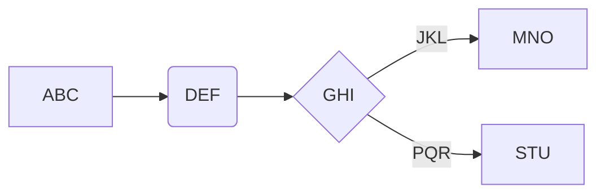

# Tech Blog 
  ------
  
[](https://opensource.org/licenses/MIT)

  ## Table of Contents
  ------

  * [Description](#description)
  * [Installation](#installation)
  * [Usage](#usage)
  * [Tests](#tests)
  * [Questions & Contributions](#questions-contribute)
  * [Credits](#credits)
  * [Licenses](#licenses)

## Description 
----- 
CMS blog, WordPress / Medium style  full stack application. 

Users who sign up and login to the site can subsequently view all published blog posts, add comments, and publish their own content. 

## Installation 
---- 
After cloning the repo to your machine, open your terminal and cd into the project directory. Next, run: 
```
mysql -u root -p; 
USE blog_db;
SOURCE db/schema.sql; 
exit;
```

After authenticating with mySQL and selecting the project database, in the same terminal, run:

```
npm i
npm run seeds
npm start 
```

## Usage 
-----
After installing all dependencies, 
be sure to create a ".dotenv" file to hide credentials as you wish. 

Open your browser and navigate to localhost:3001, where you will be prompted to login or signup. 

The rest is easy!


## Questions & Contact 
------ 
Reach out 
ianclark@gmail.com

##
_________

```flow
st=>start: Start
op=>operation: ABC
cond=>condition: Yes or No?
e=>end

st->op->cond
cond(yes)->e
cond(no)->op
```


